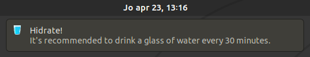
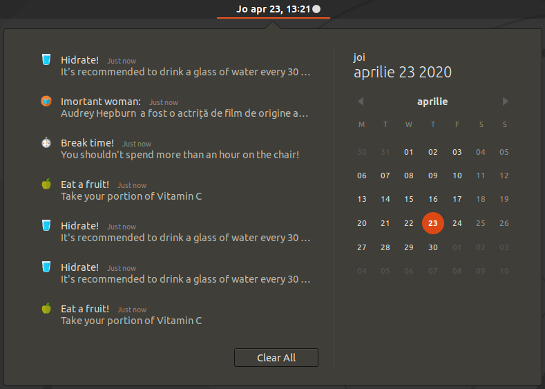

# NotificationProject

A script which sends notifications with custom icons and sound, currently we only have two classes of notifications:

 1. Health
    - Notification to take a break from hour to hour
    - Notification to drink water once in 30 minutes
    - Notification eat a fruit once in 1 and a half hours

 2. Culture
    - Notification with info about music instruments
    - Notification with info about important women along history
    - Notification with info about cool destinations

<p align="center">


</p>


Anyone can add more methods for any type of notifications, geting the information is based on webscraping from wikipedia or any other site.


Installation
============
You will need to install next packages, some might be already installed in your system

1. gi: __`sudo apt install python-gi`__
2. notify: __`sudo apt install gir1.2-notify-0.7`__
3. mpg123: __`sudo apt install mpg123`__                   
4. beautifoulsoup4: __`sudo apt-get install python3-bs4`__    
5. lxml: __`sudo apt-get install python3-lxml`__      

Create an alias: __`alias start='./source.py'`__
```diff
# you need to create alias after every reboot
```

Service automatization
======================

How to create the service:

1. Give permissions: __`chmod +x service_maker.py`__
2. Create & Start service: __`sudo ./service_maker.py`__ 
3. Stop & Delete service: __`./clean.sh`__  

<b>WARNING</b>: ```service_maker.py``` is not yet ready, don't use untill this message is gone!!! Run with __`start`__ alias from [Installation](https://github.com/pvl26/NotificationProject/tree/master#installation) for now.

Original Developers
-------------------

 * Mateescu Pavel-Vlad - [Pvl26](https://github.com/Pvl26)
 * Dutica Maria-Diana - [DianaDutica](https://github.com/DianaDutica)

Contribute
==========

Any contribution is welcome. The current problems are:

 1. notifyapp.service generated by ```service_maker.py``` has an error.

Feel free to make any other contribution, if you want to merge it to our repo, just make a pull request.
